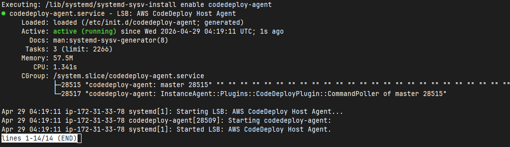

# Portfolio Web

Spring Boot와 Thymeleaf로 구현한 개인 포트폴리오 웹 애플리케이션입니다.
현재는 **실제 포트폴리오 콘텐츠를 브라우저에서 확인할 수 있는 웹 화면**, **프로젝트/경력 조회 API**, **Swagger/OpenAPI 문서**, **AWS CodeDeploy 기반 배포 파이프라인의 뼈대**까지 갖춘 상태이며, 데이터 저장소는 더미 저장소와 프로필 기반 설정으로 분리되어 있어 이후 PostgreSQL 연동으로 확장하기 쉽도록 구성되어 있습니다.



## 프로젝트 개요

- 개인 소개, 프로젝트, 경력, 연락처 정보를 하나의 웹 서비스로 제공하는 포트폴리오 사이트입니다.
- 서버 사이드 렌더링(SSR) 기반 페이지와 JSON API를 함께 제공해, 화면과 데이터 계층을 분리된 구조로 유지합니다.
- 현재 데이터는 `Dummy*Repository`에서 제공되며, 향후 실제 DB 저장소로 교체하기 쉽게 인터페이스 기반으로 설계되어 있습니다.
- 로컬 개발은 H2 메모리 DB를 기본값으로 사용하고, `dev`/`prod` 프로필에서는 PostgreSQL 전환을 고려한 설정이 이미 준비되어 있습니다.

## 주요 기능

### 1. 포트폴리오 페이지

- 메인 페이지: `/`
- 소개 페이지: `/about`
- 프로젝트 페이지: `/projects`
- 경력 페이지: `/experience`
- 연락처 페이지: `/contact`

`PortfolioPageController`가 각 페이지에 필요한 프로필, 프로젝트, 경력 데이터를 모델에 주입하여 Thymeleaf 템플릿으로 렌더링합니다.

### 2. 프로젝트/경력 조회 API

- `GET /api/v1/projects`
- `GET /api/v1/experiences`

두 API는 공통 응답 래퍼인 `ApiResponse`를 사용하며, 성공/실패 응답 형식을 일관되게 유지합니다.

```json
{
  "success": true,
  "data": [],
  "message": "정상 처리되었습니다."
}
```

또한 요청 파라미터 검증 실패 등은 `GlobalExceptionHandler`를 통해 공통 형식으로 처리됩니다.

### 3. 문서화 및 개발 편의 기능

- Swagger UI: `http://localhost:8080/swagger-ui/index.html`
- OpenAPI Docs: `http://localhost:8080/v3/api-docs`
- H2 Console: `http://localhost:8080/h2-console`

로컬 실행만으로 API 문서와 H2 콘솔을 함께 확인할 수 있어 개발 및 확인이 편리합니다.

### 4. 배포 파이프라인 기반 마련

`.github/workflows/deploy.yml`에는 `master` 브랜치 푸시를 기준으로 다음 흐름이 구성되어 있습니다.

- Gradle `bootJar` 빌드
- 배포 패키지(zip) 생성
- AWS S3 업로드
- AWS CodeDeploy 배포 생성
- GitHub Actions OIDC 기반 AWS 인증 사용

즉, 애플리케이션 코드뿐 아니라 실제 배포 자동화 흐름까지 함께 관리하는 프로젝트입니다.

## 기술 스택

### Backend

- Java 21
- Spring Boot 3.5.14
- Spring Web
- Spring Validation
- Thymeleaf

### Data / Documentation

- H2 Database
- PostgreSQL
- springdoc-openapi (`springdoc-openapi-starter-webmvc-ui`)

### Build / Deploy

- Gradle
- GitHub Actions
- AWS S3
- AWS CodeDeploy

## 실행 방법

### 사전 요구 사항

- JDK 21
- Gradle Wrapper 사용 가능 환경

### 로컬 실행

기본 활성 프로필은 `local`이며, H2 메모리 DB를 사용합니다.

```powershell
.\gradlew bootRun
```

macOS / Linux 환경이라면 다음 명령을 사용할 수 있습니다.

```bash
./gradlew bootRun
```

애플리케이션 실행 후 접속 가능한 주요 경로는 다음과 같습니다.

| 구분 | 경로 |
| --- | --- |
| 메인 페이지 | `http://localhost:8080/` |
| 소개 페이지 | `http://localhost:8080/about` |
| 프로젝트 페이지 | `http://localhost:8080/projects` |
| 경력 페이지 | `http://localhost:8080/experience` |
| 연락처 페이지 | `http://localhost:8080/contact` |
| Swagger UI | `http://localhost:8080/swagger-ui/index.html` |
| OpenAPI Docs | `http://localhost:8080/v3/api-docs` |
| H2 Console | `http://localhost:8080/h2-console` |

## 실행 프로필과 데이터 소스

`src/main/resources/application.yml` 기준으로 다음과 같이 구성되어 있습니다.

### `local` 프로필

- 기본 활성 프로필
- H2 메모리 DB 사용
- Thymeleaf 캐시 비활성화
- H2 콘솔 활성화

### `dev` 프로필

- PostgreSQL 사용
- 로컬 개발용 외부 DB 연동 목적
- Thymeleaf 캐시 비활성화

실행 예시:

```powershell
.\gradlew bootRun --args="--spring.profiles.active=dev"
```

### `prod` 프로필

- PostgreSQL 사용
- DB 계정 정보는 환경 변수로 주입 가능
- Thymeleaf 캐시 활성화

### Docker Compose 참고 사항

프로젝트 루트의 `compose.yaml`에는 PostgreSQL 컨테이너 예시가 포함되어 있습니다. 다만 현재 `compose.yaml`의 DB 이름/계정 정보와 `application.yml`의 `dev`/`prod` 설정은 기본값이 서로 다르므로, 실제 연동 시에는 **둘 중 한쪽 값을 맞춰서 사용해야 합니다.**

## 테스트

```powershell
.\gradlew test
```

통합 테스트에서는 다음 항목을 검증합니다.

- 각 페이지가 올바른 뷰 이름과 모델 데이터를 사용해 렌더링되는지
- 분리된 CSS/JS 정적 리소스가 정상 제공되는지
- 프로젝트/경력 API가 공통 응답 형식으로 반환되는지
- 잘못된 요청 파라미터가 예외 응답으로 처리되는지
- OpenAPI 문서가 정상 노출되는지

## 프로젝트 구조

```text
src/main/java/com/frostycityman/sqlannotator/portfolio_web
├─ common
│  ├─ exception          # 공통 예외 및 전역 예외 처리
│  └─ response           # API 공통 응답 래퍼
├─ config                # Web / OpenAPI 설정
├─ controller
│  ├─ api                # JSON API 컨트롤러
│  └─ page               # Thymeleaf 페이지 컨트롤러
├─ domain/dto            # 화면/API 전달용 DTO
├─ repository            # 저장소 인터페이스 및 더미 구현체
├─ service               # 서비스 인터페이스 및 구현체
└─ PortfolioWebApplication.java

src/main/resources
├─ static
│  ├─ css
│  ├─ image
│  └─ js
├─ templates
│  ├─ fragments          # head / header / footer 조각 템플릿
│  ├─ layout             # 공통 레이아웃
│  └─ page               # 개별 페이지 템플릿
├─ application.properties
└─ application.yml
```

## 현재 구현 상태

### 구현 완료

- 개인 포트폴리오용 SSR 페이지 5종
- 프로젝트/경력 조회 API
- 공통 응답 포맷 및 전역 예외 처리
- Swagger/OpenAPI 연동
- H2 기반 로컬 실행 환경
- GitHub Actions + AWS CodeDeploy 배포 워크플로 초안

### 아직 확장 가능한 부분

- PostgreSQL 기반 실제 영속 저장소 구현
- 관리자 페이지 및 인증/권한 관리
- 연락처 폼 저장 API 및 알림 연동
- 운영 환경에 맞춘 보안 정책 세분화

## 향후 확장 아이디어

- `DummyRepository` 구현을 실제 DB 저장소 구현체로 교체
- Spring Security를 도입해 관리자 영역 접근 제어 구성
- 프로젝트 등록/수정/삭제를 위한 관리 기능 추가
- CI 단계에서 테스트와 품질 검사를 더 강화
- 배포 스크립트와 운영 설정을 환경별로 분리 고도화
